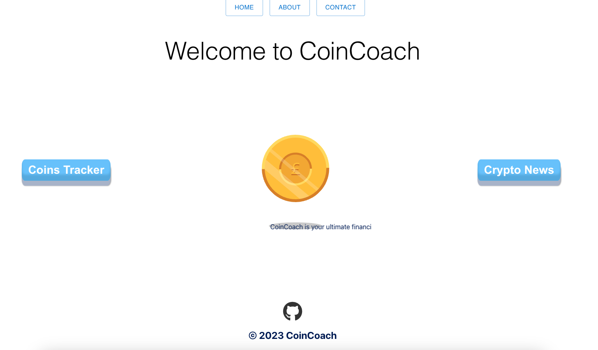
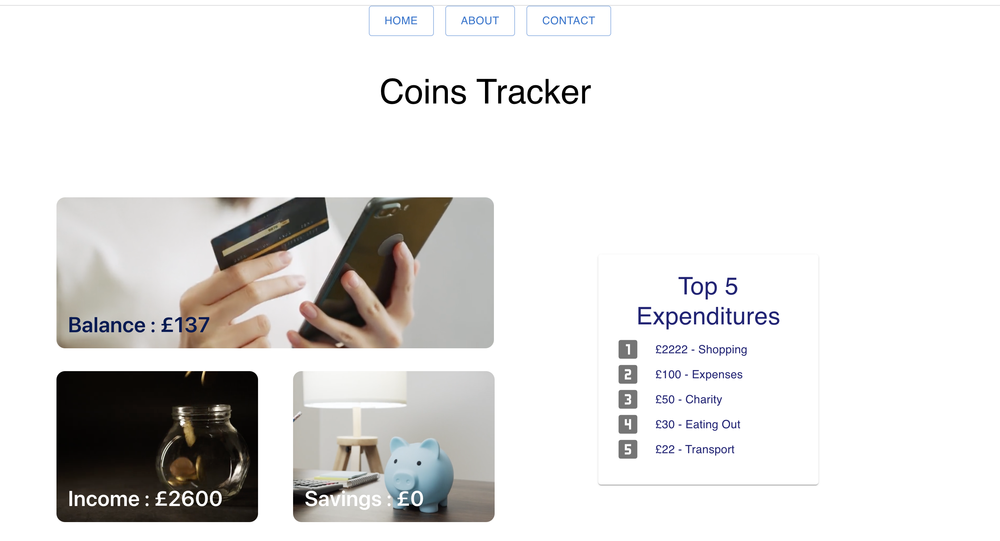
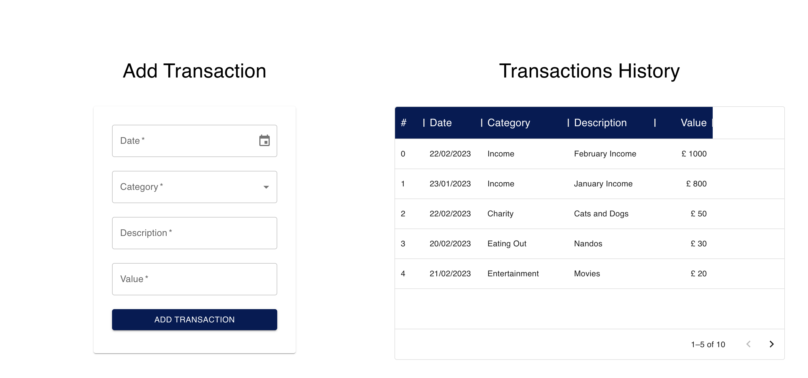
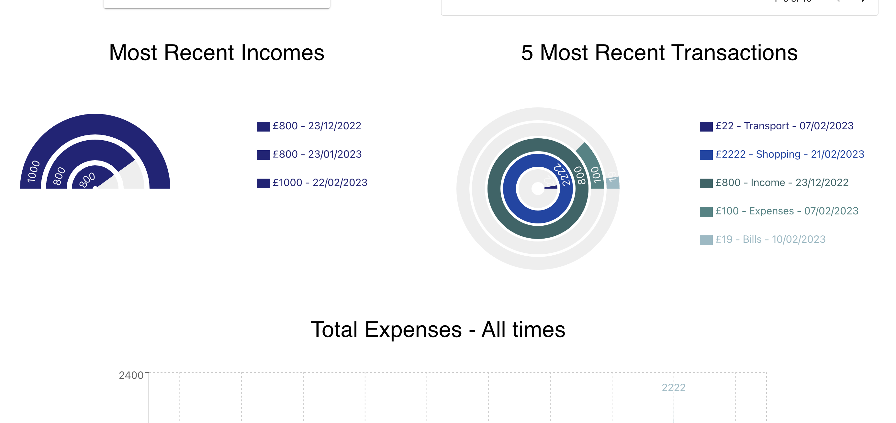
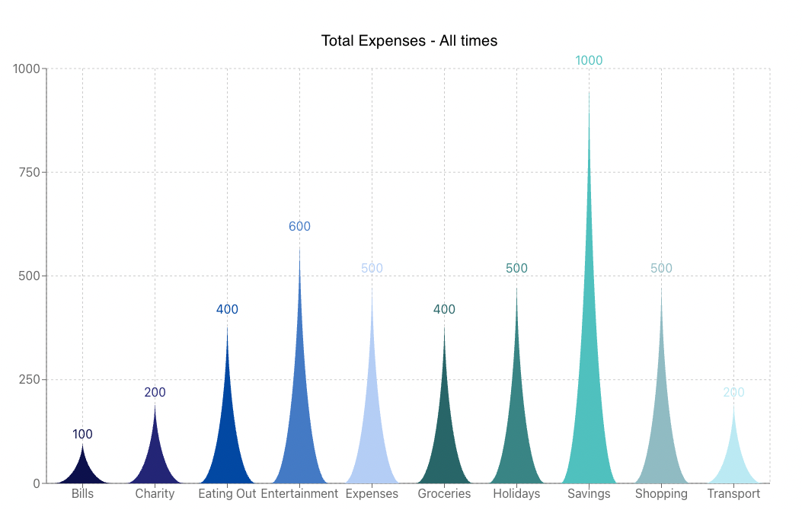
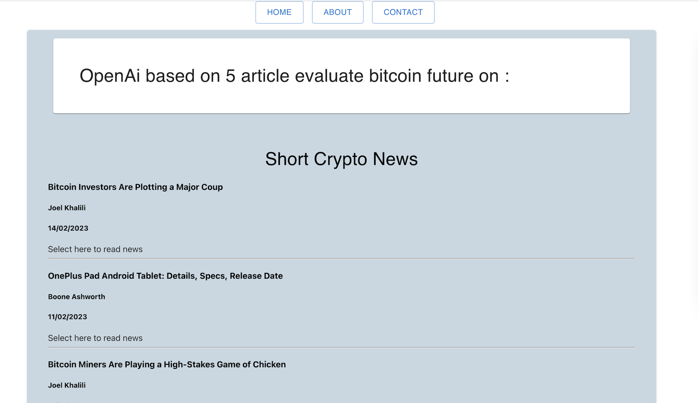

## CoinCoach

## Description

CoinCoach is the ultimate financial companion to help you keep track of your spending and keep up to date with all the latest crypto news. This application was created with React to build an intuitive user interface and Material UI to streamline the design process whilst Open AI and News API are used to assist users in keeping up to date with Crypto news. CoinCoach is a must have app for effortlessly tracking your finances!

Visit CoinCoach here: [CoinCoach](https://coincoachapp.netlify.app/)

## Screenshots

## Table of Contents

- [Description](#description)
- [Screenshots](#screenshots)
- [Usage](#usage)
- [Contributors](#contributors)
- [Credits](#credits)
- [License](#license)

## Usage

The CoinCoach Coin Tracker helps you monitor your spending. By using the Add Transaction form, you can add your income alongside all of the transactions you would like to track, this could be anything from Bills to Savings to Entertainment. Once added, you will be able to easily track your remaining balance, top expenditures and more.

If you want to use the application to keep up to date with all the latest on Crypto, our Crypto news section allows you to do just that! This section pulls in all of the latest news articles on Crypto via News API, if you would like to read the article in full, just click on the image!

## Contributors

- [sabrina-martorelli](https://github.com/sabrina-martorelli)
- [nrai14](https://github.com/nrai14)
- [MichalMatu](https://github.com/MichalMatu)
- [lauralp92](https://github.com/lauralp92)

## Credits

- [Material UI](https://mui.com/)
- [Joy UI](https://mui.com/joy-ui/getting-started/overview/)
- [MomentJs](https://momentjs.com/)
- [Recharts](https://recharts.org/en-US)
- [Vecteezy](https://www.vecteezy.com/)
- [Gold Coin Animation](https://codepen.io/abadu)
- [Open AI](https://openai.com/)
- [News API](https://newsapi.org/)
- [Web3 Form API](https://api.web3forms.com/submit)

## License

MIT License

Copyright (c) 2023 CoinCoach

Permission is hereby granted, free of charge, to any person obtaining a copy
of this software and associated documentation files (the "Software"), to deal
in the Software without restriction, including without limitation the rights
to use, copy, modify, merge, publish, distribute, sublicense, and/or sell
copies of the Software, and to permit persons to whom the Software is
furnished to do so, subject to the following conditions:

The above copyright notice and this permission notice shall be included in all
copies or substantial portions of the Software.

THE SOFTWARE IS PROVIDED "AS IS", WITHOUT WARRANTY OF ANY KIND, EXPRESS OR
IMPLIED, INCLUDING BUT NOT LIMITED TO THE WARRANTIES OF MERCHANTABILITY,
FITNESS FOR A PARTICULAR PURPOSE AND NONINFRINGEMENT. IN NO EVENT SHALL THE
AUTHORS OR COPYRIGHT HOLDERS BE LIABLE FOR ANY CLAIM, DAMAGES OR OTHER
LIABILITY, WHETHER IN AN ACTION OF CONTRACT, TORT OR OTHERWISE, ARISING FROM,
OUT OF OR IN CONNECTION WITH THE SOFTWARE OR THE USE OR OTHER DEALINGS IN THE
SOFTWARE.
